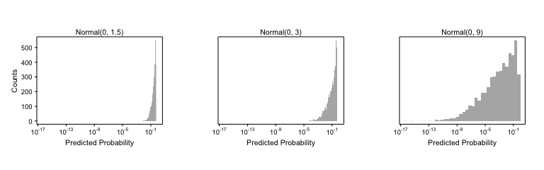

# README

This is the beginnings of an R packages that implements the ideas in my
paper on dealing with separation in logit models. You can find pdf of the working draft of that paper [here](http://www.carlislerainey.com/papers/separation.pdf) and the GitHub repository for the paper [here](https://github.com/carlislerainey/priors-for-separation).

`separation` requires the latest version of `compactr`, and both of these packages are available on GitHub.


```r
devtools::install_github("carlislerainey/compactr")
devtools::install_github("carlislerainey/separation")
```

The idea is simple. In order to draw meaningful inferences when facing separation, you must choose an informative prior. This can be tricky with logistic regression models, because the coefficients are not on a scale that many researchers are comfortable with. To facilitate choose a reasonable, informative prior, researchers might focus on the partial prior predictive distribution, explained in the paper linked to above. The partial prior distribution allows researchers to focus on the usual quantities of interest, such as predicted probabilities, first-differences, and risk-ratios. Researchers can use this package to what prior distributions for the coefficients imply about the partial prior preditive distribution, which is easier to make sense of.

Let's look at a simple example. Suppose we estimate a simple model explaining governors' decisions to oppose the Medicaid expansion under the Affordable Care Act. In particular, we'd like to draw a conclusion about whether a governor's partisanship matters more than the level of need in her state. We might estimate a simple model using the data from [Barrilleaux and Rainey](http://www.carlislerainey.com/papers/need.pdf), which is included in the package `separation` installed above.


```r
data(politics_and_need)
f <- oppose_expansion ~ gop_governor + percent_favorable_aca + gop_leg + percent_uninsured + 
    bal2012 + multiplier + percent_nonwhite + percent_metro
m <- glm(f, family = binomial, data = politics_and_need)

library(texreg)  # for screenreg, which neatly prints the results
```

```
## Version:  1.33
## Date:     2014-07-21
## Author:   Philip Leifeld (University of Konstanz)
## 
## Please cite the JSS article in your publications -- see citation("texreg").
```

```r
screenreg(m)
```

```
## 
## ================================
##                        Model 1  
## --------------------------------
## (Intercept)              -19.39 
##                        (3224.41)
## gop_governor              20.35 
##                        (3224.40)
## percent_favorable_aca      0.01 
##                           (0.09)
## gop_leg                    2.43 
##                           (1.48)
## percent_uninsured          0.11 
##                           (0.27)
## bal2012                    0.00 
##                           (0.01)
## multiplier                -0.32 
##                           (1.08)
## percent_nonwhite           0.05 
##                           (0.08)
## percent_metro             -0.08 
##                           (0.05)
## --------------------------------
## AIC                       49.71 
## BIC                       66.92 
## Log Likelihood           -15.86 
## Deviance                  31.71 
## Num. obs.                 50    
## ================================
## *** p < 0.001, ** p < 0.01, * p < 0.05
```

You'll notice that we have separation, because no Democratic governors opposed the expansion, the variable `gop_governor` perfectly predicts zeros. We can see this in a table.


```r
xtabs(~ oppose_expansion + gop_governor, data = politics_and_need)
```

```
##                 gop_governor
## oppose_expansion  0  1
##                0 20 14
##                1  0 16
```

This separation leads to implausibly large estimates for the coefficient for `gop_governor` and, because the perfect prediction occurs when `gop_governor` equals one, the intercept as well. Notice, perhaps most importantly, that the standard errors are unusable as well.

To get a handle on this, we need to provide some form of prior information to stablize the coefficient for `gop_governor`, which will in turn provide a reasonable estimate for the intercept. But what prior should we choose for `gop_governor`? A N(0, 2)? and N(0, 4)? What? To help make this choice, I introduce the concept of a partial prior predictive distribution that allows researchers to focus narrowly on a single region of the prior distribute--the only part that really matters. See [the paper](http://www.carlislerainey.com/papers/separation.pdf) for the details. 

We have three quantities of interest that we might choose to focus on.

1. predicted probability: The probability that a Democratic governor opposes the expansion.
2. first-difference: The change in the probability of expansion as a governor's partisanship changes from Democrat to Republican.
3. risk-ratio: How many times more likely is a Republican governor to oppose the expansion compared to a Democratic governor.

In this case, it seems reasonable to focus on the probability that a Democratic governor opposes the expansion. That also happens to be the default quantity for the functions.

Let's choose a N(0, 3) as a first guess at an "informative" prior distribution. (I know this is a reasonable choice because I experimented a little before writing this.) We first need to simulate from our chosen prior and then we can convert those simulation into simulations of predicted probabilities using the function `calc_pppd()`.


```r
# load package
library(separation)

# load data
data(politics_and_need)

# simulate from potential prior
set.seed(1234)
normal_3 <- rnorm(10000, sd = 3)

# model formula
f <- oppose_expansion ~ gop_governor + percent_favorable_aca + gop_leg + percent_uninsured + 
    bal2012 + multiplier + percent_nonwhite + percent_metro

# informative prior
pppd_inf <- calc_pppd(f, data = politics_and_need, prior_sims = normal_3,     
                   sep_var_name = "gop_governor", prior_label = "Normal(0, 3)")
```

We can summarize the percentiles of the distrubiotn with the generic `print()` function.


```r
print(pppd_inf)
```

```
## 
## Model:	oppose_expansion ~ gop_governor + percent_favorable_aca + gop_leg + 
##     percent_uninsured + bal2012 + multiplier + percent_nonwhite + 
##     percent_metro
## Prior for gop_governor:	Normal(0, 3)
## 
##    percentile	predicted probability	first-difference	risk-ratio	
##    1%		0.001			0.011			1.021			
##    5%		0.004			0.046			1.094			
##    25%		0.036			0.215			1.678			
##    50%		0.135			0.397			3.951			
##    75%		0.317			0.495			14.62			
##    95%		0.486			0.528			149.5			
##    99%		0.521			0.531			945.8			
```

That looks reasonable. There is an even chance of the probabilty of opposition falling above and below 0.09, which seems about right. Also, there is a 25% chance that the probability falls below 0.02, which also seems like a reasonable prior belief.

To get an even better feel for this PPPD, we can use the generic `plot()` function to plot the distribution of the predicted probability.


```r
plot(pppd_inf)
```

 

If we care about the distribution for the tiny probabilities, we can plot the distribution on the log scale. 


```r
plot(pppd_inf, log_scale = TRUE)
```

 

Again, the purpose of the prior distribution in dealing with separation is to rule out implausible large effects. Plotting on the log scale allows us to see exactly what predicted probabilities we are ruling out. We are essentially ruling out probabilities smaller than 0.001, which seems reasonable. 

If we want, we can calculate the probability of falling below certain thresholds.


```r
mean(pppd_inf$pr < 0.01)
```

```
## [1] 0.1126
```

```r
mean(pppd_inf$pr < 0.001)
```

```
## [1] 0.01665
```

From this we can see that there is a probability of 0.15 that less than 1% of Democratic governors oppose the expansion and a probability of 0.025 that less than 0.1% of Democratic governors oppose the expansion. Again, these seem reasonable.

We might also like to compare our informative prior to a "skeptical" and "enthusiastic" prior distribution. For simplicity, let's go with half and double the standard deviation of the informative prior, respectively. We can calculate the PPPD for these distributions as before and use the `combine_pppd()` function to put them together and then the generic `plot()` function for plotting.


```r
# simulate from potential skeptical and enthusiastic priors
set.seed(1234)
normal_1 <- rnorm(10000, sd = 1.5)
normal_4 <- rnorm(10000, sd = 9)

# enthusiastic and skeptical prior
pppd_enth <- calc_pppd(f, data = politics_and_need, prior_sims = normal_4, 
                   sep_var_name = "gop_governor", prior_label = "Normal(0, 9)")
pppd_skep <- calc_pppd(f, data = politics_and_need, prior_sims = normal_1, 
                   sep_var_name = "gop_governor", prior_label = "Normal(0, 1.5)")
pppds <- combine_pppd(pppd_skep, pppd_inf, pppd_enth)

# plot all pppds for comparisons
plot(pppds)
```

 

```r
plot(pppds, log_scale = TRUE)
```

 

The notation looks a little sloppy, so we can use `compactr::eplot()`'s ability to use scientific notation by giving the argument `xticklab = "sci_notation"`, which `plot()` will pass to `compactr::eplot()`.


```r
plot(pppds, log_scale = TRUE, xticklab = "sci_notation")
```

 

Now that we've chosen the three priors, we can do the MCMC using the `sim_pos_normal()` functions.


```r
# enthusiastic and skeptical prior
set.seed(1234)
post_inf <- sim_post_normal(f, data = politics_and_need, 
                            sep_var = "gop_governor", sd = 3, 
                            n_sims = 1000)
```

```
## 
## Computing proposal distribution...
## 
## Running 3 chains in parallel of 1500 iterations each--this may take a while...
## Finished running chains!
## 
## Checking convergence...
## 
## ######## WARNING: #########
## 
## The multivariate R-hat statistic of 1.22 suggests that the chains have NOT converged.
```

```r
post_enth <- sim_post_normal(f, data = politics_and_need, 
                            sep_var = "gop_governor", sd = 9, 
                            n_sims = 1000)
```

```
## 
## Computing proposal distribution...
## 
## Running 3 chains in parallel of 1500 iterations each--this may take a while...
## Finished running chains!
## 
## Checking convergence...
## 
## ######## WARNING: #########
## 
## The multivariate R-hat statistic of 1.23 suggests that the chains have NOT converged.
```

```r
post_skep <- sim_post_normal(f, data = politics_and_need, 
                            sep_var = "gop_governor", sd = 1.5, 
                            n_sims = 1000)
```

```
## 
## Computing proposal distribution...
## 
## Running 3 chains in parallel of 1500 iterations each--this may take a while...
## Finished running chains!
## 
## Checking convergence...
## 
## ######## WARNING: #########
## 
## The multivariate R-hat statistic of 1.21 suggests that the chains have NOT converged.
```

And we can compare the coefficients for `gop_governor` to see how the priors affected the inferences.


```r
posts <- combine_post(post_skep, post_inf, post_enth)
plot(posts, var_name = "gop_governor")
```

 

Notice that the posteriors are quite different, with the skeptical prior ruling out coefficients that are larger than about four and the enthusiastic prior suggesting that coefficients as large as about 14 are plausible.

But how does this affect the key quantities of interest?


```r
X_pred_list <- set_at_median(f, politics_and_need)
X_pred_list$gop_governor <- 0:1

qi_inf <- calc_qi(post_inf, X_pred_list, qi_name = "fd")
qi_enth <- calc_qi(post_enth, X_pred_list, qi_name = "fd")
qi_skep <- calc_qi(post_skep, X_pred_list, qi_name = "fd")

qis <- combine_qi(qi_skep, qi_inf, qi_enth)

plot(qis, xlim = c(0, 1), xat = c(0, .2, .4, .6, .8, 1))
```

 

We can also do "hypothesis tests" using the posterior probabilities of the research hypothesis (i.e., the number of MCMC simulations that are consistent with the researcher's hypothesis) using the `plot_hyp_test()` function.


```r
plot_hyp_test(posts, "gop_governor", research_hyp = "+", xlab = expression(Pr(beta[GOP~Gov] > 0)))
```

 

```r
plot_hyp_test(posts, "percent_uninsured", research_hyp = "-", xlab = expression(Pr(beta[Uninsured] > 0)))
```

 

I've also worked hard to make `separation` "abondonable" at any point, so that you can use it to generate your own quantities of interest but make your own plots, for example. This allows the user to have complete control over how to present her results.


```r
gg_inf <- data.frame(qi_inf$fn_args$post$prior, qi_inf$qi_sims)
gg_enth <- data.frame(qi_enth$fn_args$post$prior, qi_enth$qi_sims)
gg_skep <- data.frame(qi_skep$fn_args$post$prior, qi_skep$qi_sims)
names(gg_inf) <- names(gg_enth) <- names(gg_skep) <- c("Prior", "Simulations")

gg <- rbind(gg_inf, gg_enth, gg_skep)

library(ggplot2)
ggplot(gg, aes(Simulations, fill = Prior)) +
  geom_density(alpha = 0.4) + theme_classic()
```

 


```r
library(arm)
```

```
## Loading required package: MASS
## Loading required package: Matrix
## Loading required package: lme4
## Loading required package: Rcpp
## 
## arm (Version 1.7-03, built: 2014-4-27)
## 
## Working directory is /Users/carlislerainey/Dropbox/packages/separation
## 
## 
## Attaching package: 'arm'
## 
## The following object is masked from 'package:texreg':
## 
##     coefplot
```

```r
politics_and_need$std_percent_uninsured <- rescale(politics_and_need$percent_uninsured)

f <- oppose_expansion ~ gop_governor + percent_favorable_aca + gop_leg + std_percent_uninsured + 
    bal2012 + multiplier + percent_nonwhite + percent_metro

set.seed(1234)
post_inf_std <- sim_post_normal(f, data = politics_and_need, 
                            sep_var = "gop_governor", sd = 3, 
                            n_sims = 1000)
```

```
## 
## Computing proposal distribution...
## 
## Running 3 chains in parallel of 1500 iterations each--this may take a while...
## Finished running chains!
## 
## Checking convergence...
## 
## ######## WARNING: #########
## 
## The multivariate R-hat statistic of 1.12 suggests that the chains have NOT converged.
```

```r
post_enth_std <- sim_post_normal(f, data = politics_and_need, 
                            sep_var = "gop_governor", sd = 9, 
                            n_sims = 1000)
```

```
## 
## Computing proposal distribution...
## 
## Running 3 chains in parallel of 1500 iterations each--this may take a while...
## Finished running chains!
## 
## Checking convergence...
## 
## ######## WARNING: #########
## 
## The multivariate R-hat statistic of 1.09 suggests that the chains have NOT converged.
```

```r
post_skep_std <- sim_post_normal(f, data = politics_and_need, 
                            sep_var = "gop_governor", sd = 1.5, 
                            n_sims = 1000)
```

```
## 
## Computing proposal distribution...
## 
## Running 3 chains in parallel of 1500 iterations each--this may take a while...
## Finished running chains!
## 
## Checking convergence...
## 
## ######## WARNING: #########
## 
## The multivariate R-hat statistic of 1.21 suggests that the chains have NOT converged.
```

```r
post_jeffreys_std <- sim_post_jeffreys(f, data = politics_and_need, 
                            n_sims = 5000)
```

```
## 
## Computing proposal distribution...
## 
## Running 3 chains in parallel of 7500 iterations each--this may take a while...
## Finished running chains!
## 
## Checking convergence...
## 
## ######## WARNING: #########
## 
## The multivariate R-hat statistic of 1.13 suggests that the chains have NOT converged.
```

```r
data(politics_and_need_rescaled)
f_gelman <- oppose_expansion ~ gop_governor + percent_favorable_aca + gop_leg +
   percent_uninsured + bal2012 + multiplier + percent_nonwhite + percent_metro
post_gelman_std <- sim_post_gelman(f_gelman, data = politics_and_need_rescaled, 
                            n_sims = 1000)
```

```
## 
## Computing proposal distribution...
## 
## Running 3 chains in parallel of 1500 iterations each--this may take a while...
## Finished running chains!
## 
## Checking convergence...
## 
## ######## WARNING: #########
## 
## The multivariate R-hat statistic of 1.13 suggests that the chains have NOT converged.
```

```r
# posts <- combine_post(post_skep_std, post_inf_std, post_enth_std, 
#              post_jeffreys_std, post_gelman_std)
#
# plot(posts, var_name = "gop_governor",
#     xlab = "Coefficient for GOP Governor",
#     ylab = "Posterior Density")

library(compactr)
par(mfrow = c(2, 3), oma = c(3, 3, 1, 1), mar = c(1, 1, 1, 1))
# skeptical prior
eplot(xlim = range(post_skep_std$mcmc[, "gop_governor"],
                   post_inf_std$mcmc[, "gop_governor"],
                   post_enth_std$mcmc[, "gop_governor"]),
      ylim = range(post_skep_std$mcmc[, "std_percent_uninsured"],
                   post_inf_std$mcmc[, "std_percent_uninsured"],
                   post_enth_std$mcmc[, "std_percent_uninsured"]),
      xlab = "Coefficient for GOP Governor",
      ylab = "Coefficient for Percent Uninsured",
      main = "Normal(0, 1.5)")
cwh <- 1*(post_skep_std$mcmc[, "gop_governor"] > -post_skep_std$mcmc[, "std_percent_uninsured"])
abline(a = 0, b = -1)
points(post_skep_std$mcmc[, "gop_governor"], 
       post_skep_std$mcmc[, "std_percent_uninsured"],
       col = rgb(1 - cwh, cwh, 0, .1))
text(12, 7, paste("Pr(Research Hyp.) = ", round(mean(cwh), 2), sep = ""))
# informative prior
aplot("Normal(0, 3)")
cwh <- 1*(post_inf_std$mcmc[, "gop_governor"] > -post_inf_std$mcmc[, "std_percent_uninsured"])
abline(a = 0, b = -1)
points(post_inf_std$mcmc[, "gop_governor"], 
       post_inf_std$mcmc[, "std_percent_uninsured"],
       col = rgb(1 - cwh, cwh, 0, .1))
text(12, 7, paste("Pr(Research Hyp.) = ", round(mean(cwh), 2), sep = ""))
# enthusiastic prior
aplot("Normal(0, 9)")
cwh <- 1*(post_enth_std$mcmc[, "gop_governor"] > -post_enth_std$mcmc[, "std_percent_uninsured"])
abline(a = 0, b = -1)
points(post_enth_std$mcmc[, "gop_governor"], 
       post_enth_std$mcmc[, "std_percent_uninsured"],
       col = rgb(1 - cwh, cwh, 0, .1))
text(12, 7, paste("Pr(Research Hyp.) = ", round(mean(cwh), 2), sep = ""))
# Jeffreys prior
aplot("Jeffreys' Prior")
cwh <- 1*(post_jeffreys_std$mcmc[, "gop_governor"] > -post_jeffreys_std$mcmc[, "std_percent_uninsured"])
abline(a = 0, b = -1)
points(post_jeffreys_std$mcmc[, "gop_governor"], 
       post_jeffreys_std$mcmc[, "std_percent_uninsured"],
       col = rgb(1 - cwh, cwh, 0, .1))
text(12, 7, paste("Pr(Research Hyp.) = ", round(mean(cwh), 2), sep = ""))
# Gelman et al.'s prior
aplot("Gelman et al.'s Prior")
cwh <- 1*(post_gelman_std$mcmc[, "gop_governor"] > -post_gelman_std$mcmc[, "percent_uninsured"])
abline(a = 0, b = -1)
points(post_gelman_std$mcmc[, "gop_governor"], 
       post_gelman_std$mcmc[, "percent_uninsured"],
       col = rgb(1 - cwh, cwh, 0, .1))
text(12, 7, paste("Pr(Research Hyp.) = ", round(mean(cwh), 2), sep = ""))
```

 

The green points in this figure are consistenth with the research hypothsis that $\beta_{\text{GOP Gov.}} > -\beta_{\text{Std. %Uninsured}}$. We can see that the choice of prior chances the strenght of evidence about the posterior probability of this hypothesis. In this case, the researcher would probably draw similar substantive conclusions, but this example illustrates that changing the prior has the potential to change inferences when comparing coefficients.
